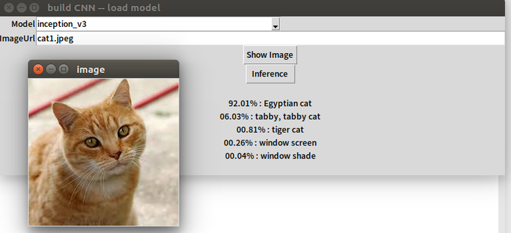

# MMdnn - Utilization for Keras to Tensorflow

[MMdnn]((https://github.com/Microsoft/MMdnn)) is a model converter and enables us to transform model from a framework to another. This repository introduces the **utilization of MMdnn** and provide a simple **GUI** for inference task of image classification.

Firstly, download weights(.h5) and model structure(.json) form **Keras** and then convert them to **Intermediate Representation(IR)**. You can visualize IR if you'd like by  [MMdnn model visualizer](http://mmdnn.eastasia.cloudapp.azure.com:8080/) .

Secondly, convert IR to **Tensorflow** weights and model structure(.ckpt) as well as a runable python module(.py). 

Thirdy, create module `try_inference_tf` for inference by module `inference_tf`. 

Last but not least,  use python module `try_inference_tf` for inference.

All you need to do is to set : 1) the path of your folder, 2) which model you'd like to use,  3) the path of image to be infered, 4) your self-defined name for this inference.

If you evironment setting has already done (step 1&2) and you'd like to run it by only using one command, you can modify the file `infer_keras2tf.sh`  and run below command (for step 3-10):

```shell
sh infer_keras2tf.sh
```

For **the first time you run this code**, it's nessasary to use **the above command** OR **step 1-10 of the following paragraph**.  Afterward, you could do inference derectly by the command such like:

```shell
python -c "from try_inference_tf import inference;print(inference('cat1.jpeg','inception_v3'))"
```


And get **the inference result by model 'inception_v3' for image 'cat1.jpeg'**:

> 72.76% : tiger cat
> 13.49% : tabby, tabby cat
> 08.87% : Egyptian cat
> 00.84% : plastic bag
> 00.33% : lynx, catamount

Or, you could do inference by a simple GUI.  Use below command to open GUI.

```shell
python GUI_sim_1.py
```

Change model and ImageURL by editting the texts. Click `Inference` button to obtain the the inference result:




# Step-by-Step Commands

## Step 1. Confirm Toolkit

- keras >= 2.0
- tensorflow >= 1.4
- Pillow >= 4.2
- Numpy >= 1.14
- Tkinter == '$Revision: 81008 $'
- Develop under Ubuntu 16.04


## Step 2. Install MMdnn

[https://github.com/Microsoft/MMdnn](https://github.com/Microsoft/MMdnn)

```shell
sudo pip install -U git+https://github.com/Microsoft/MMdnn.git@master 
#sudo pip install https://github.com/Microsoft/MMdnn/releases/download/0.1.2/mmdnn-0.1.2-py2.py3-none-any.whl # This version has error!! #sudo pip uninstall MMdnn
```

It returns 

> Successfully installed mmdnn-0.1.2 protobuf-3.5.1 setuptools-38.5.1

## Step 3. Decide the path name

- Download this repository as a new folder. 
- Open **terminal** in this folder. Run commands below step by step.

```shell
selfDefinedFileName="try" #<your self-defined name for this inference>
mainPath="/home/phoebehuang/20180214/" #<your folder path>
cd ${mainPath}
oriModelPath=${mainPath}"ori_model_meta/" 
IRpath=${mainPath}"gen_pb_json_npy/"
HWIRpath=${mainPath}"json_hw/" 
CodePath=${mainPath}"gen_code/";echo "" >> ${CodePath}__init__.py
genModelPath=${mainPath}"gen_model/"
mkdir "ori_model_meta/" "gen_pb_json_npy/" "gen_code/"  "gen_model/" "json_hw/"
```


## Step 4. Decide the model name

Choose which model you'd like to use.

```shell
model="inception_v3"  
#model="vgg16"
#model="vgg19"
#model="resnet"
#model="mobilenet"
#model="xception"
```


## Step 5. Download the pre-trained Keras models 

```shell
python -m mmdnn.conversion.examples.keras.extract_model -n ${model}
#move model to a certain folder
mv imagenet_${model}.h5 ${oriModelPath}; mv imagenet_${model}.json ${oriModelPath}
```

It returns 

> Downloading data from https://github.com/fchollet/deep-learning-models/releases/download/v0.5/inception_v3_weights_tf_dim_ordering_tf_kernels.h5
>
> 96116736/96112376 [==============================] - 129s 1us/step
>
> 96124928/96112376 [==============================] - 129s 1us/step
>
> Network structure is saved as [imagenet_inception_v3.json].
>
> Network weights are saved as [imagenet_inception_v3.h5].

## Step 6. Convert model to IR

```shell
#Convert architecture from Keras to IR
python -m mmdnn.conversion._script.convertToIR -f keras -d ${IRpath}${selfDefinedFileName}_${model} -n ${oriModelPath}imagenet_${model}.json
#Convert model (including architecture and weights) from Keras to IR
python -m mmdnn.conversion._script.convertToIR -f keras -d ${IRpath}${selfDefinedFileName}_${model} -n ${oriModelPath}imagenet_${model}.json -w ${oriModelPath}imagenet_${model}.h5
```

It returns :

> Network file [ori_model_meta/imagenet_inception_v3.json] and [ori_model_meta/imagenet_inception_v3.h5] is loaded successfully.
>
> IR network structure is saved as [gen_pb_json_npy/try_inception_v3.json].
>
> IR network structure is saved as [gen_pb_json_npy/try_inception_v3.pb].
>
> IR weights are saved as [gen_pb_json_npy/try_inception_v3.npy].

## (Optional) Visualization:

Open the [MMdnn model visualizer](http://mmdnn.eastasia.cloudapp.azure.com:8080/) and choose `.json` file under folder `${IRpath}`


## Step 7. Convert models from IR to Tensorflow code snippet

```shell
python -m mmdnn.conversion._script.IRToCode -f tensorflow --IRModelPath ${IRpath}${selfDefinedFileName}_${model}.pb --IRWeightPath ${IRpath}${selfDefinedFileName}_${model}.npy --dstModelPath ${CodePath}${selfDefinedFileName}_tensorflow_${model}.py
# test 
#python -m mmdnn.conversion.examples.tensorflow.imagenet_test -s tensorflow -p ${model} -n ${selfDefinedFileName}_tensorflow_${model} -w ${IRpath}${selfDefinedFileName}_${model}.npy
```

It returns :

> Parse file [gen_pb_json_npy/try_inception_v3.pb] with binary format successfully.
> Target network code snippet is saved as [gen_code/try_tensorflow_inception_v3.py].

## Step 8. Convert models from IR to Tensorflow model

```shell
cd ${CodePath}
python -m mmdnn.conversion.examples.tensorflow.imagenet_test -n ${selfDefinedFileName}_tensorflow_${model}.py -w ${IRpath}${selfDefinedFileName}_${model}.npy --dump ${genModelPath}${selfDefinedFileName}_tf_${model}.ckpt
cd ${mainPath}
```

It returns :

> Tensorflow file is saved as [/home/phoebehuang/itri/20180214/gen_model/try_tf_inception_v3.ckpt], generated by [try_tensorflow_inception_v3.py] and [/home/phoebehuang/itri/20180214/gen_pb_json_npy/try_inception_v3.npy].


## Step 9. Create Inference Python Module

```shell
python inference_tf.py -n ${selfDefinedFileName}
```

It will create `${selfDefinedFileName}_inference_tf.py`, which is `try_inference_tf.py` in this case.

## Step 10. Use Tensorflow model for Inference   

Set image path, can be local or a URL.

```shell
inferImgPath="cat.jpeg" # you can change to the other local path or a URL
python -c "from try_inference_tf import inference;print(inference('${inferImgPath}','${model}' ))"
```


And get **the inference result by model 'inception_v3' for image 'cat.jpeg'**:

> 92.01% : Egyptian cat
> 06.03% : tabby, tabby cat
> 00.81% : tiger cat
> 00.26% : window screen
> 00.04% : window shade

Or, you could do inference by a simple **GUI**.  Use below command to open GUI.

```shell
python GUI_sim_1.py
```

Change model and ImageURL by editting the texts. Click `Inference` button to obtain the the inference result:

