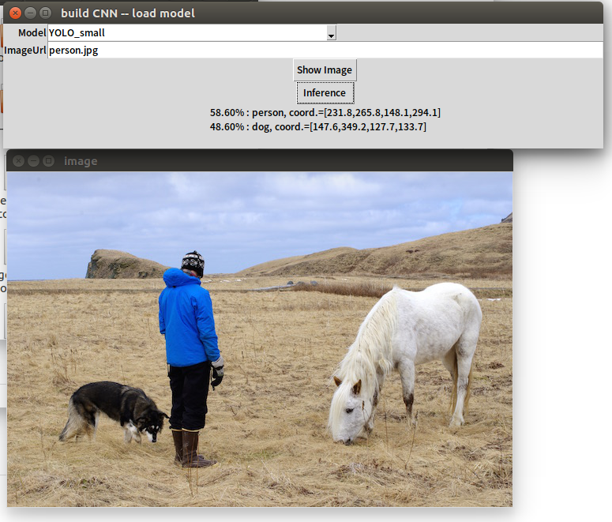

# YOLO_tensorflow for Inference

Codes in this folder are modified from https://github.com/gliese581gg/YOLO_tensorflow


## Step 1. Download YOLO weights

Download YOLO **weight** file from

YOLO_small : <https://drive.google.com/file/d/0B2JbaJSrWLpza08yS2FSUnV2dlE/view?usp=sharing>

YOLO_tiny  : <https://drive.google.com/file/d/0B2JbaJSrWLpza0FtQlc3ejhMTTA/view?usp=sharing>

YOLO_face : <https://drive.google.com/file/d/0B2JbaJSrWLpzMzR5eURGN2dMTk0/view?usp=sharing>

and put these weights into subfolder `weights/`


## Step 2. Inference

Go to parent folder `../`

Open **terminal** and run:

```shell
python -c "from try_inference_tf import inference;print(inference('person.jpg','YOLO_small'))"
```

And you'll get **the inference result by model 'YOLO_small' for image 'person.jpg'**:

> 58.60% : person, coord.=[231.8,265.8,148.1,294.1]
> 48.60% : dog, coord.=[147.6,349.2,127.7,133.7]

Or, you could do inference by a simple **GUI**.  Use below command to open GUI.

```shell
python GUI_sim_1.py
```

